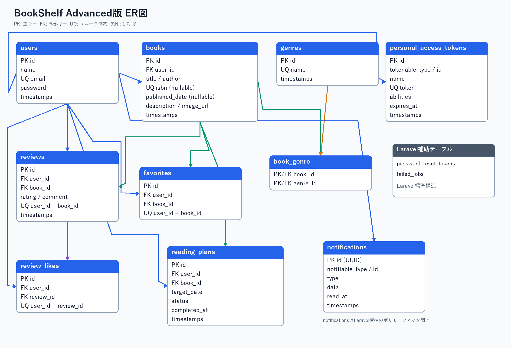

# BookShelf 書籍レビューアプリ

## 概要

BookShelfは、書籍の登録、レビュー、お気に入り、レビューへのいいね、ジャンル管理、ランキングを行えるLaravel製のWebアプリケーションです。

Advanced版では、複合検索、Google Books APIを利用したISBN検索、読書統計レポート、SanctumによるAPI認証、読書計画、リマインダー通知を追加しています。

## 主な機能

- Laravel Fortifyによる会員登録、ログイン、ログアウト
- 書籍の登録、閲覧、編集、削除
- 書籍名・著者名による検索、ジャンル絞り込み、並び替え
- Google Books APIによるISBN-13検索と書籍情報の自動入力
- レビューの投稿、編集、削除
- お気に入りとレビューへのいいね
- ジャンル管理
- 平均評価によるランキング
- マイ読書レポート
- JSON形式の書籍API
- Laravel Sanctumによる書き込みAPIの認証・認可
- 読書計画の作成、編集、完了、削除、状態絞り込み
- 日次処理による期限切れ更新とリマインダー通知
- 通知一覧、未読件数表示、既読処理

## 使用技術

| 分類 | 技術 |
|---|---|
| バックエンド | PHP 8.5、Laravel 10.50.3 |
| データベース | MySQL 8.4 |
| 認証 | Laravel Fortify、Laravel Sanctum |
| フロントエンド | Blade、Vite 5、Tailwind CSS 3.4、Alpine.js |
| 開発環境 | Docker、Laravel Sail、phpMyAdmin |
| テスト・整形 | PHPUnit 10、Laravel Pint |
| 外部API | Google Books API |

## ER図



テーブルの詳細は[Advanced版データベース設計](docs/advanced-database-design.md)を参照してください。

## 環境構築

### 前提条件

- Docker Desktopが利用できること
- WSL2など、Laravel Sailを実行できるシェル環境が利用できること
- Gitが利用できること

### 1. リポジトリの取得

```bash
git clone https://github.com/Natsumi-Ogino/bookshelf-app.git
cd bookshelf-app
```

### 2. 環境変数ファイルの作成

```bash
cp .env.example .env
```

`.env`は秘密情報を含むため、Gitへ登録しないでください。

### 3. PHP依存パッケージのインストール

初回だけ、PHP 8.2のComposer用コンテナを使用して依存パッケージをインストールします。

```bash
docker run --rm -u "$(id -u):$(id -g)" -v "$(pwd):/var/www/html" -w /var/www/html -e COMPOSER_CACHE_DIR=/tmp/composer_cache laravelsail/php82-composer:latest composer install
```

### 4. コンテナの起動

```bash
./vendor/bin/sail up -d
```

### 5. アプリケーションキーの生成

```bash
./vendor/bin/sail artisan key:generate
```

### 6. フロントエンド依存パッケージのインストールとビルド

```bash
./vendor/bin/sail npm install
./vendor/bin/sail npm run build
```

開発中にViteの変更監視を使用する場合は、次を実行したままにします。

```bash
./vendor/bin/sail npm run dev
```

### 7. マイグレーションと初期データの投入

```bash
./vendor/bin/sail artisan migrate --seed
```

## Google Books APIの設定

ISBN検索機能ではGoogle Books APIを使用します。

1. Google Cloud Consoleでプロジェクトを作成します。
2. 対象プロジェクトでBooks APIを有効にします。
3. APIキーを作成します。
4. APIキーの「APIの制限」をBooks APIだけに設定します。
5. `.env`の`GOOGLE_BOOKS_API_KEY`へ発行したAPIキーを設定します。
6. 設定キャッシュを削除します。

```dotenv
GOOGLE_BOOKS_API_KEY=発行したAPIキー
```

```bash
./vendor/bin/sail artisan config:clear
```

実際のAPIキーは`.env.example`、README、Git、ログへ記録しないでください。

## 開発環境URL

| 用途 | URL |
|---|---|
| Webアプリケーション | http://localhost |
| phpMyAdmin | http://localhost:8080 |

## 初期ユーザー

`./vendor/bin/sail artisan migrate --seed`を実行すると、動作確認用ユーザーが登録されます。初期ユーザーの情報は`database/seeders/UserSeeder.php`で確認できます。

## APIエンドポイント

| HTTPメソッド | URI | 認証 | 概要 |
|---|---|---|---|
| GET | `/api/v1/books` | 不要 | 書籍一覧、キーワード検索、ジャンル絞り込み、ページネーション |
| GET | `/api/v1/books/{book}` | 不要 | 書籍詳細、ジャンル、レビューの取得 |
| POST | `/api/v1/tokens` | 不要 | Sanctumトークンの発行 |
| DELETE | `/api/v1/tokens/current` | Bearerトークン必須 | 現在使用中のトークンを削除 |
| POST | `/api/v1/books` | Bearerトークン必須 | 書籍を登録 |
| PUT | `/api/v1/books/{book}` | Bearerトークンと所有者認可が必要 | 書籍を更新 |
| DELETE | `/api/v1/books/{book}` | Bearerトークンと所有者認可が必要 | 書籍を削除 |

### トークンの発行

`POST /api/v1/tokens`へ次のJSONを送信します。

```json
{
  "email": "登録済みのメールアドレス",
  "password": "登録済みのパスワード",
  "device_name": "利用端末名"
}
```

発行されたトークンはレスポンスで一度だけ確認し、安全な場所で管理します。書き込みAPIでは、HTTPヘッダーへ次の形式で指定します。

```text
Authorization: Bearer 発行されたトークン
Accept: application/json
```

トークンの有効期限は発行から30日です。トークン発行APIは、メールアドレスとIPアドレスの組み合わせごとに1分間5回までに制限しています。

## 読書計画の定期処理

リマインダー処理は、次の条件で通知を作成します。

- 目標日の3日前
- 目標日の当日
- 目標日の3日後

目標日を過ぎた進行中の計画は期限切れへ更新されます。同じ計画・同じ通知時期の通知は重複作成されません。

手動で確認する場合は、次を実行します。

```bash
./vendor/bin/sail artisan reading-plans:process-reminders
```

本番環境ではLaravel Schedulerが毎分動くよう、サーバーのcronへ次を設定します。

```cron
* * * * * cd /path/to/bookshelf-app && php artisan schedule:run >> /dev/null 2>&1
```

アプリケーション側では、リマインダー処理を`Asia/Tokyo`の毎日0時に実行するよう設定しています。

## テストとコード品質の確認

```bash
./vendor/bin/sail artisan test
./vendor/bin/sail artisan test --coverage
./vendor/bin/sail bin pint --test
./vendor/bin/sail npm run build
```

外部APIを利用する自動テストでは`Http::fake()`を使用し、実際のGoogle Books APIへ通信しません。

## 作成者

荻野 なつみ
