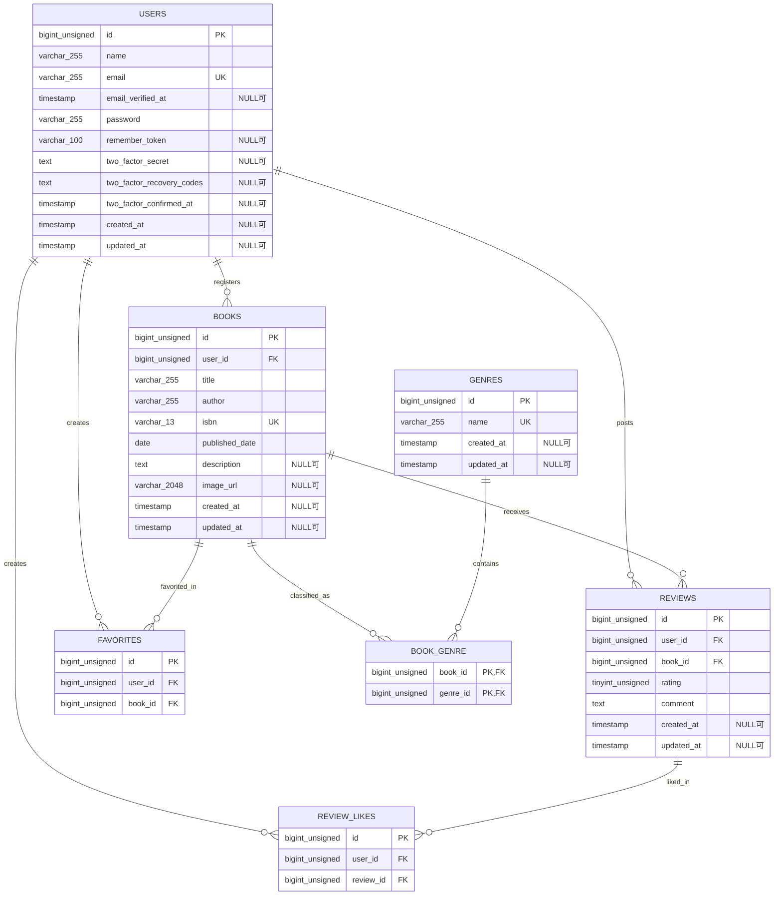

# BookShelf Basic版 データベース設計案

## この文書の位置付け

この文書は、要件シートのシート11「データ要件」、シート12「テーブル仕様書」、2026年9月8日、9月15日および9月16日のコーチ回答を基にした設計案です。

2026年9月16日の追加回答により、Basic版のISBNと設計書の形式を含むデータベース設計は確定しました。

## 確定済みの設計方針

- 1ユーザーが同じ書籍へ投稿できるレビューは1件までとする。
- `reviews`の`user_id`と`book_id`には複合ユニーク制約を設定する。
- `book_genre`は`id`とtimestampsを持たせず、`book_id`と`genre_id`を複合主キーとする。
- `favorites`と`review_likes`は`id`を主キーとして持たせ、2つの外部キーに複合ユニーク制約を設定する。
- `favorites`と`review_likes`は`created_at`と`updated_at`を持たせない。
- ユーザー、書籍、レビューを削除した場合、従属する関連データはcascadeで削除する。
- 書籍が紐付いているジャンルは削除できないようにする。
- `books.image_url`はNULLを許可し、最大長は2048文字とする。
- `books.isbn`は必須の`VARCHAR(13)`とし、ユニーク制約を設定する。
- `reviews.comment`は必須入力、最大1000文字、NULL不可とする。
- 自分が投稿したレビューにはいいねできないようにする。
- Basic版の`users`にはFortifyの二要素認証用3カラムを保持する。
- シート12のテーブル仕様書とER図、シート13のAPI仕様書、シート2のヒアリング記録、リポジトリ内の設計文書を本案件の設計書として扱う。

## ER図（設計案）

Basic版の`books.isbn`は必須です。Advanced版のNULL可否は、Advanced版へ着手するときに改めて検討します。

## テーブル仕様案

### users

| カラム | 型 | NULL | 制約・補足 |
|---|---|---|---|
| id | BIGINT UNSIGNED | 不可 | 主キー |
| name | VARCHAR(255) | 不可 |  |
| email | VARCHAR(255) | 不可 | ユニーク |
| email_verified_at | TIMESTAMP | 可 |  |
| password | VARCHAR(255) | 不可 | ハッシュ化して保存 |
| remember_token | VARCHAR(100) | 可 |  |
| two_factor_secret | TEXT | 可 | Fortify用 |
| two_factor_recovery_codes | TEXT | 可 | Fortify用 |
| two_factor_confirmed_at | TIMESTAMP | 可 | Fortify用 |
| created_at | TIMESTAMP | 可 | Laravel timestamps |
| updated_at | TIMESTAMP | 可 | Laravel timestamps |

### books

| カラム | 型の案 | NULL | 制約・補足 |
|---|---|---|---|
| id | BIGINT UNSIGNED | 不可 | 主キー |
| user_id | BIGINT UNSIGNED | 不可 | `users.id`への外部キー、ユーザー削除時cascade |
| title | VARCHAR(255) | 不可 |  |
| author | VARCHAR(255) | 不可 |  |
| isbn | VARCHAR(13) | 不可 | 半角数字13桁、ユニーク。チェックディジット検証は行わない |
| published_date | DATE | 不可 | Advanced版のNULL可否はAdvanced版着手時に検討 |
| description | TEXT | 可 |  |
| image_url | VARCHAR(2048) | 可 | 最大長は承認済み |
| created_at | TIMESTAMP | 可 | Laravel timestamps |
| updated_at | TIMESTAMP | 可 | Laravel timestamps |

### genres

| カラム | 型 | NULL | 制約・補足 |
|---|---|---|---|
| id | BIGINT UNSIGNED | 不可 | 主キー |
| name | VARCHAR(255) | 不可 | ユニーク |
| created_at | TIMESTAMP | 可 | Laravel timestamps |
| updated_at | TIMESTAMP | 可 | Laravel timestamps |

書籍が紐付いているジャンルの削除は拒否し、日本語エラーメッセージを表示してジャンル一覧へ戻します。

### book_genre

| カラム | 型 | NULL | 制約・補足 |
|---|---|---|---|
| book_id | BIGINT UNSIGNED | 不可 | 複合主キー、`books.id`への外部キー、書籍削除時cascade |
| genre_id | BIGINT UNSIGNED | 不可 | 複合主キー、`genres.id`への外部キー、ジャンル削除時restrict |

`id`、`created_at`、`updated_at`は持たせません。

### reviews

| カラム | 型 | NULL | 制約・補足 |
|---|---|---|---|
| id | BIGINT UNSIGNED | 不可 | 主キー |
| user_id | BIGINT UNSIGNED | 不可 | `users.id`への外部キー、ユーザー削除時cascade |
| book_id | BIGINT UNSIGNED | 不可 | `books.id`への外部キー、書籍削除時cascade |
| rating | TINYINT UNSIGNED | 不可 | 1から5まで |
| comment | TEXT | 不可 | 必須入力、最大1000文字 |
| created_at | TIMESTAMP | 可 | Laravel timestamps |
| updated_at | TIMESTAMP | 可 | Laravel timestamps |

`user_id`と`book_id`の組み合わせに複合ユニーク制約を設定します。

### favorites

| カラム | 型 | NULL | 制約・補足 |
|---|---|---|---|
| id | BIGINT UNSIGNED | 不可 | 主キー、保持する方針は承認済み |
| user_id | BIGINT UNSIGNED | 不可 | `users.id`への外部キー、ユーザー削除時cascade |
| book_id | BIGINT UNSIGNED | 不可 | `books.id`への外部キー、書籍削除時cascade |

`user_id`と`book_id`の組み合わせに複合ユニーク制約を設定します。`created_at`と`updated_at`は持たせません。

### review_likes

| カラム | 型 | NULL | 制約・補足 |
|---|---|---|---|
| id | BIGINT UNSIGNED | 不可 | 主キー、保持する方針は承認済み |
| user_id | BIGINT UNSIGNED | 不可 | `users.id`への外部キー、ユーザー削除時cascade |
| review_id | BIGINT UNSIGNED | 不可 | `reviews.id`への外部キー、レビュー削除時cascade |

`user_id`と`review_id`の組み合わせに複合ユニーク制約を設定します。`created_at`と`updated_at`は持たせません。また、`review_id`がログインユーザー自身のレビューを指す場合は、いいねを登録できないようにします。

## Laravel標準認証補助テーブル

次のテーブルはLaravel標準Migrationの定義を維持し、アプリ独自のカラムは追加しません。

### password_reset_tokens

| カラム | 型 | NULL | 制約・補足 |
|---|---|---|---|
| email | VARCHAR(255) | 不可 | 主キー |
| token | VARCHAR(255) | 不可 |  |
| created_at | TIMESTAMP | 可 |  |

### personal_access_tokens

| カラム | 型 | NULL | 制約・補足 |
|---|---|---|---|
| id | BIGINT UNSIGNED | 不可 | 主キー |
| tokenable_type | VARCHAR(255) | 不可 | ポリモーフィック関連 |
| tokenable_id | BIGINT UNSIGNED | 不可 | ポリモーフィック関連 |
| name | VARCHAR(255) | 不可 |  |
| token | VARCHAR(64) | 不可 | ユニーク |
| abilities | TEXT | 可 |  |
| last_used_at | TIMESTAMP | 可 |  |
| expires_at | TIMESTAMP | 可 |  |
| created_at | TIMESTAMP | 可 | Laravel timestamps |
| updated_at | TIMESTAMP | 可 | Laravel timestamps |

`tokenable_type`と`tokenable_id`には複合インデックスが設定されます。

### failed_jobs

| カラム | 型 | NULL | 制約・補足 |
|---|---|---|---|
| id | BIGINT UNSIGNED | 不可 | 主キー |
| uuid | VARCHAR(255) | 不可 | ユニーク |
| connection | TEXT | 不可 |  |
| queue | TEXT | 不可 |  |
| payload | LONGTEXT | 不可 |  |
| exception | LONGTEXT | 不可 |  |
| failed_at | TIMESTAMP | 不可 | 登録時に現在日時を設定 |

## 削除時の挙動

| 削除対象 | 関連データの扱い |
|---|---|
| ユーザー | 登録書籍、投稿レビュー、お気に入り、レビューへのいいねをcascade削除 |
| 書籍 | レビュー、ジャンル紐付け、お気に入りをcascade削除。レビュー削除に伴いレビューへのいいねもcascade削除 |
| レビュー | レビューへのいいねをcascade削除 |
| ジャンル | 書籍が紐付いている場合は削除を拒否。紐付いていない場合だけ削除可能 |

## 設計書として扱う成果物

- 要件シートのシート2「あなたのタスク」に記録したヒアリング内容
- 要件シートのシート12「テーブル仕様書」とER図
- 要件シートのシート13「API仕様書」
- リポジトリ内のデータベース設計文書

別形式の設計書は作成しません。
